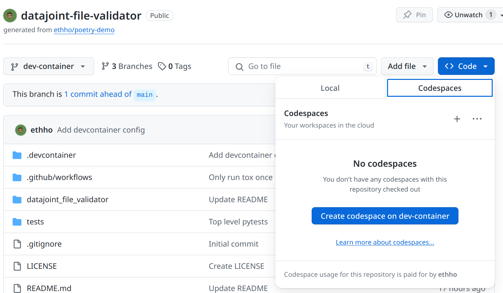

# DataJoint File Validator

<p align="center">
<a href="https://github.com/ethho/datajoint-file-validator/actions?query=workflow%3ATest" target="_blank">
    
</a>
<!-- <a href="https://github.com/ethho/datajoint-file-validator/actions?query=workflow%3APyPi" target="_blank">
    
</a> -->
<a href="https://coverage-badge.samuelcolvin.workers.dev/redirect/ethho/datajoint-file-validator" target="_blank">
    
<!-- <a href="https://pypi.org/project/datajoint-file-validator" target="_blank">
    
</a> -->
</p>

This repository contains a Python package that validates file sets for DataJoint pipelines.

## Installation

### Install Locally

```bash
pip install datajoint_file_validator@git+https://github.com/ethho/datajoint-file-validator.git
```

### Dev Container

This repository includes a [devcontainer](https://code.visualstudio.com/docs/devcontainers/containers) configuration for [Visual Studio Code](https://code.visualstudio.com/). To use it, either:

1. Install the [Remote - Containers](https://marketplace.visualstudio.com/items?itemName=ms-vscode-remote.remote-containers) extension in VS Code and open the repository in a container.
2. Open the devcontainer in GitHub Codespaces:



## Quick Start

Validate a fileset against an existing manifest:

```python
from datajoint_file_validator import validate

my_dataset_path = 'tests/data/filesets/fileset0'
manifest_path = 'datajoint_file_validator/manifests/demo_dlc/v0.1.yaml'
success, report = validate(my_dataset_path, manifest_path, verbose=True, format='json')
# Validation failed with the following errors:
# [
#     {
#         'rule': 'Min total files',
#         'rule_description': 'Check that there are at least 6 files anywhere in the fileset',
#         'constraint_id': 'count_min',
#         'constraint_value': 6,
#         'errors': 'constraint `count_min` failed: 4 < 6'
#     }
# ]

print(success)
# False
```

Alternatively, validate using the included command line interface:

```console
$ datajoint-file-validator validate tests/data/filesets/fileset0 datajoint_file_validator/manifests/demo_dlc/v0.1.yaml
❌ Validation failed with 1 errors!
┏━━━━━━━━━━━━━━━━┳━━━━━━━━━━━━━━━━┳━━━━━━━━━━━━━━━┳━━━━━━━━━━━━━━━┳━━━━━━━━━━━━━━━━┓
┃                ┃ Rule           ┃               ┃ Constraint    ┃                ┃
┃ Rule ID        ┃ Description    ┃ Constraint ID ┃ Value         ┃ Errors         ┃
┡━━━━━━━━━━━━━━━━╇━━━━━━━━━━━━━━━━╇━━━━━━━━━━━━━━━╇━━━━━━━━━━━━━━━╇━━━━━━━━━━━━━━━━┩
│ Min total      │ Check that     │ count_min     │ 6             │ constraint     │
│ files          │ there are at   │               │               │ `count_min`    │
│                │ least 6 files  │               │               │ failed: 4 < 6  │
│                │ anywhere in    │               │               │                │
│                │ the fileset    │               │               │                │
└────────────────┴────────────────┴───────────────┴───────────────┴────────────────┘
```

## Author

Ethan Ho @ethho

## License

[MIT](LICENSE)