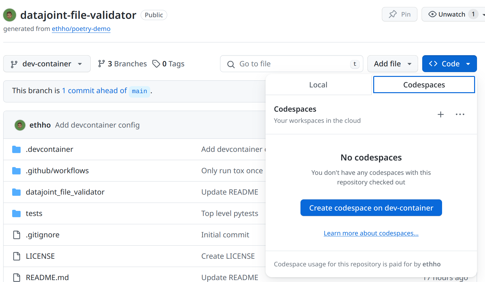

# Contribute

## Set Up a Development Environment

After cloning this repository, set up a development environment by using either [Poetry](#using-poetry) or [Dev Container](#using-dev-container).

### Using Poetry

This project uses [Poetry](https://python-poetry.org/) to manage dependencies. To set up a development environment, install Poetry and run `poetry install`:

```console
$ pipx install poetry
$ poetry install --with dev
```

When [running tests](#run-tests), [serving documentation](#build-and-serve-documentation), [using the CLI](./quick_start.md#using-the-command-line-interface-cli), or issuing any project-specific shell commands, be sure to either:

* Issue all commands after entering the [poetry virtual environment](https://python-poetry.org/docs/basic-usage/#activating-the-virtual-environment)
	* Enter the virtual environment with `poetry shell`
	* Exit the virtual environment with `deactivate`
* Preface all commands with [`poetry run`](https://python-poetry.org/docs/basic-usage/#using-poetry-run)
	* For example, run unit tests with `poetry run pytest`

### Using Dev Container

This repository includes a [devcontainer](https://code.visualstudio.com/docs/devcontainers/containers) configuration for [Visual Studio Code](https://code.visualstudio.com/). To use it, either:

1. Install the [Remote - Containers](https://marketplace.visualstudio.com/items?itemName=ms-vscode-remote.remote-containers) extension in VS Code and open the repository in a container.
2. Open the devcontainer in GitHub Codespaces:



## Run Tests

This project uses [pytest](https://docs.pytest.org/en/stable/) for testing. To run tests, issue the `pytest` command in the [Dev Container](#using-dev-container) or [poetry](#using-poetry) environment from the base of the repository:

```console
$ pytest
# With coverage
$ poetry run pytest --cov-report term-missing --cov=datajoint_file_validator tests
```

## Build and Serve Documentation

This project uses [mkdocs](https://www.mkdocs.org/) to build documentation. To build and serve documentation, issue the `mkdocs` command in the [Dev Container](#using-dev-container) or [poetry](#using-poetry) environment from the base of the repository:

```console
$ mkdocs serve
```

