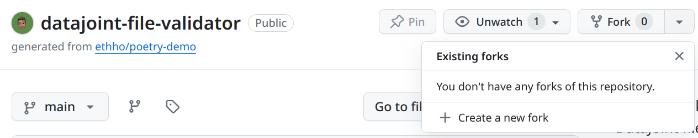

# 3. Publish a Custom Manifest to the Registry

If you've been following along the tutorial, you now have a manifest file for your custom fileset type `my_type`.
Though you can already use the manifest to validate filesets, you might want to share it with others (say, in your research group or with collaborators).
In this section, we'll guide you through the process of publishing your manifest to the registry.

## 3.1. Using GitHub

Currently, the only supported way to publish a manifest is to add it to the standard library, which is distributed with the [Python package](https://github.com/ethho/datajoint-file-validator.git).

### 3.1.1. Fork the Repository

First, create a fork of the DataJoint File Validator GitHub repository: [`https://github.com/ethho/datajoint-file-validator.git`](https://github.com/ethho/datajoint-file-validator.git):



### 3.1.2. Clone the Fork

Next, clone your fork to your local machine:

<!-- termynal -->

```console
$ export GITHUB_USERNAME="<your GitHub username>"
$ git clone https://github.com/${GITHUB_USERNAME}/datajoint-file-validator.git
---> 100%
$ cd datajoint-file-validator
$ git switch -c main
```

### 3.1.3. Push Your Manifest File to Your Fork

Now, create a new directory in the standard library directory that is named after your fileset type.
Ensure that the name of your fileset type is unique across all manifests.
Since our example fileset type is called `my_type`, we will create a directory called `my_type`:

<!-- termynal -->

```console
$ mkdir datajoint_file_validator/manifests/my_type
```

Copy your manifest file to this new directory, with a file name that matches the `version` of the manifest file.
The version of our manifest is `0.1.0`, so we will copy the manifest file to `datajoint_file_validator/manifests/my_type/v0.1.0.yaml`.
We also want to create a symbolic link called `default.yaml` that points to the `v0.1.0.yaml` file.
This symlink is necessary in order for the Python package to recognize our new manifest file.

<!-- termynal -->

```console
$ cp my_type.yaml datajoint_file_validator/manifests/my_type/v0.1.0.yaml
$ ln -s v0.1.0.yaml datajoint_file_validator/manifests/my_type/default.yaml
```

We can then commit and push changes to our fork:

<!-- termynal -->

```console
$ git add datajoint_file_validator/manifests/my_type/
$ git commit -m "Add manifest for my_type v0.1.0"
$ git push origin main
```


### 3.1.4. Create a Pull Request Against the Main Repository

Finally, create a pull request against the `main` branch of the main repository by following this link:

[Click here to create a pull request for a new manifest](https://github.com/ethho/datajoint-file-validator/compare/main?template=new_manifest.md&labels=new-manifest,manifest&title=New+Manifest&assignees=ethho)
